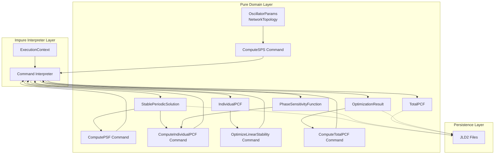

# データ構造定義書

**プロジェクト名**: 2次元イジングモデル モンテカルロシミュレーション (Ising2D)
**バージョン**: 2.0
**作成日**: 2025-12-05
**最終更新日**: 2025-12-05
**設計方針**: FDD (Functional Declarative Design)

---

## 目次

1. [FDDに基づく型設計方針](#1-fddに基づく型設計方針)
2. [Domain Layer型定義](#2-domain-layer型定義)
3. [eDSL設計](#3-edsl設計)
4. [Service Layer型定義](#4-service-layer型定義)
5. [データフォーマット (JLD2)](#5-データフォーマット-jld2)
6. [データフロー](#6-データフロー)
7. [バリデーション設計](#7-バリデーション設計)

---

## 1. FDDに基づく型設計方針

### 1.1 型設計の基本原則

FDDでは、型を「本質的複雑さ」を表現する手段として活用し、「偶有的複雑さ」を最小化する。

```
Type Design Principles (FDD)
├── Immutability First: 不変データ構造を優先
├── Make Illegal States Unrepresentable: 不正な状態を型で排除
├── Algebraic Data Types: 直和型・直積型で表現
├── Smart Constructors: バリデーション付きコンストラクタ
└── Phantom Types: コンパイル時の安全性保証
```

### 1.2 Pure/Impure分離における型の役割

| 層 | 型の特徴 | 例 |
|----|----------|-----|
| **Domain Layer (Pure)** | 不変、検証済み、ドメイン意味を持つ | `OscillatorParams`, `NetworkTopology` |
| **Service Layer (Pure)** | インターフェース定義、関数シグネチャ | `SimulationService` |
| **Interpreter Layer (Impure)** | 実行状態、IO結果 | `SimulationRuntime`, `FileHandle` |

### 1.3 基本定数（Pure）

```julia
# src/Domain/Constants.jl [Pure]

# 物理定数・計算パラメータ（不変）
module Constants

# 振動子数（テスト用N=4、本番用N=10で切り替え可能）
const N_OSC_DEFAULT = 10     # 各ネットワークの振動子数
const N_NET = 3              # ネットワーク数（A, B, C）
const N_THETA_DEFAULT = 101  # 1周期の位相分割数
const DS = 2                 # 各振動子の状態次元（u, v）

# 計算パラメータ
const T_RELAX = 500.0        # 初期緩和時間 [秒]
const BUFFER_MAX = 200000    # バッファ長
const ADJOINT_REP = 40       # 随伴方程式の緩和反復回数
const DT_DEFAULT = 1e-3      # 積分時間刻み
const EPSILON_DEFAULT = 2e-4 # ネットワーク間結合強度

end # module Constants
```

---

## 2. Domain Layer型定義

### 2.1 代数的データ型（ADT）

FDDでは、ドメイン概念を代数的データ型で表現する。

#### 2.1.1 直積型（Product Types）

```julia
# src/Domain/Types.jl [Pure]

using StaticArrays

#=
振動子状態の型定義
- 不変性: SVector は不変
- 型安全: 次元がコンパイル時に固定
=#

"""
単一振動子の状態（2次元ベクトル）

# 型パラメータ
- `T`: 数値型（Float64など）

# フィールド（暗黙）
- インデックス1: u（回復変数）
- インデックス2: v（膜電位変数）
"""
const OscillatorState{T} = SVector{2, T}

"""
単一ネットワークの状態（N個の振動子状態）

# 型パラメータ
- `N`: 振動子数
- `T`: 数値型
"""
const NetworkState{N, T} = SVector{N, OscillatorState{T}}

"""
全ネットワークの状態（3つのネットワーク）
注: 計算中の更新用にMVectorを使用（局所的な可変性）
"""
const AllNetworksState{N, T} = SVector{3, NetworkState{N, T}}
```

#### 2.1.2 直和型（Sum Types）

```julia
# src/Domain/Types.jl [Pure]

"""
ネットワークトポロジーの種類（直和型）
"""
abstract type TopologyType end

struct FullCoupling <: TopologyType end
struct TreeCoupling <: TopologyType
    parent_indices::Vector{Int}
end

"""
計算フェーズの状態（直和型）
"""
abstract type ComputationPhase end

struct PhaseNotStarted <: ComputationPhase end
struct PhaseSPSComputing <: ComputationPhase end
struct PhaseSPSCompleted <: ComputationPhase
    result::StablePeriodicSolution
end
struct PhasePSFComputing <: ComputationPhase end
struct PhasePSFCompleted <: ComputationPhase
    result::PhaseSensitivityFunction
end
struct PhasePCFComputing <: ComputationPhase end
struct PhasePCFCompleted <: ComputationPhase
    result::TotalPCF
end
```

### 2.2 パラメータ構造体（Smart Constructors付き）

```julia
# src/Domain/Types.jl [Pure]

"""
FitzHugh-Nagumo振動子のパラメータ

# Invariants（不変条件）
- δ > 0
- 0 < b < 1
- length(I) == N
"""
struct OscillatorParams{N}
    delta::Float64    # 時間スケール分離パラメータ
    a::Float64        # FHNパラメータ
    b::Float64        # FHNパラメータ
    I::SVector{N, Float64}  # 外部入力

    # Smart Constructor (内部)
    function OscillatorParams{N}(delta, a, b, I) where N
        delta > 0 || throw(DomainError(delta, "delta must be positive"))
        0 < b < 1 || throw(DomainError(b, "b must be in (0, 1)"))
        length(I) == N || throw(DimensionMismatch("I must have length N=$N"))
        new{N}(delta, a, b, I)
    end
end

# Smart Constructor (外部) - デフォルト値付き
function OscillatorParams(;
    N::Int = 10,
    delta::Float64 = 0.08,
    a::Float64 = 0.7,
    b::Float64 = 0.8,
    I::Union{Vector{Float64}, Nothing} = nothing
)
    I_vec = isnothing(I) ? zeros(SVector{N, Float64}) : SVector{N}(I)
    OscillatorParams{N}(delta, a, b, I_vec)
end
```

### 2.3 ネットワーク構造型

```julia
# src/Domain/Types.jl [Pure]

"""
ネットワーク内の結合トポロジー

# Invariants
- size(adjacency) == (N, N)
- diag(adjacency) == zeros(N)
"""
struct NetworkTopology{N, TT<:TopologyType}
    adjacency::SMatrix{N, N, Float64}
    topology_type::TT

    function NetworkTopology{N}(
        adjacency::AbstractMatrix{Float64},
        topology_type::TT
    ) where {N, TT<:TopologyType}
        size(adjacency) == (N, N) ||
            throw(DimensionMismatch("adjacency must be $N x $N"))
        all(diag(adjacency) .== 0) ||
            throw(DomainError(adjacency, "diagonal must be zero"))
        new{N, TT}(SMatrix{N, N}(adjacency), topology_type)
    end
end

# Factory Functions [Pure]
function full_coupling_topology(N::Int; strength::Float64 = 1.0)
    adj = strength * (ones(N, N) - I(N))
    NetworkTopology{N}(adj, FullCoupling())
end

function tree_topology(N::Int, parent_indices::Vector{Int}; strength::Float64 = 1.0)
    length(parent_indices) == N ||
        throw(DimensionMismatch("parent_indices must have length N"))
    adj = zeros(N, N)
    for (child, parent) in enumerate(parent_indices)
        if parent > 0 && parent != child
            adj[child, parent] = strength
            adj[parent, child] = strength
        end
    end
    NetworkTopology{N}(adj, TreeCoupling(parent_indices))
end
```

### 2.4 結合テンソル型

```julia
# src/Domain/Types.jl [Pure]

"""
高次結合テンソル（3体相互作用）

# Invariants
- size(tensor) == (N, N, N)
- !any(isnan, tensor)
- !any(isinf, tensor)
"""
struct CouplingTensor{N}
    tensor::Array{Float64, 3}
    coupling_type::Symbol  # :uniform, :linear_opt, :rotation_opt

    function CouplingTensor{N}(
        tensor::Array{Float64, 3},
        coupling_type::Symbol
    ) where N
        size(tensor) == (N, N, N) ||
            throw(DimensionMismatch("tensor must be $N x $N x $N"))
        !any(isnan, tensor) ||
            throw(DomainError(tensor, "tensor must not contain NaN"))
        !any(isinf, tensor) ||
            throw(DomainError(tensor, "tensor must not contain Inf"))
        new{N}(tensor, coupling_type)
    end
end

# Factory Functions [Pure]
function uniform_coupling_tensor(N::Int; strength::Float64 = 1.0)
    tensor = fill(strength / N^2, N, N, N)
    # 対角成分を0に（自己結合なし）
    for i in 1:N
        tensor[i, i, :] .= 0
        tensor[i, :, i] .= 0
        tensor[:, i, i] .= 0
    end
    CouplingTensor{N}(tensor, :uniform)
end
```

### 2.5 計算結果型（Immutable）

```julia
# src/Domain/Types.jl [Pure]

"""
安定周期解（Stable Periodic Solution）
計算結果は不変として保存
"""
struct StablePeriodicSolution{N, Ntheta}
    period::Float64                           # T: 周期 [秒]
    angular_freq::Float64                     # ω: 角周波数 [rad/s]
    trajectory::Matrix{Float64}               # Xs: (2N × Ntheta)
    params::OscillatorParams{N}
    topology::NetworkTopology{N}

    function StablePeriodicSolution{N, Ntheta}(
        period, angular_freq, trajectory, params, topology
    ) where {N, Ntheta}
        period > 0 || throw(DomainError(period, "period must be positive"))
        size(trajectory) == (2*N, Ntheta) ||
            throw(DimensionMismatch("trajectory must be $(2*N) x $Ntheta"))
        isapprox(angular_freq, 2pi / period; rtol=1e-10) ||
            throw(DomainError(angular_freq, "angular_freq must equal 2π/T"))
        new{N, Ntheta}(period, angular_freq, trajectory, params, topology)
    end
end

"""
位相感受関数（Phase Sensitivity Function）
"""
struct PhaseSensitivityFunction{N, Ntheta}
    Q::Matrix{Float64}         # Qθ: (2N × Ntheta)
    period::Float64
    angular_freq::Float64

    function PhaseSensitivityFunction{N, Ntheta}(
        Q, period, angular_freq
    ) where {N, Ntheta}
        size(Q) == (2*N, Ntheta) ||
            throw(DimensionMismatch("Q must be $(2*N) x $Ntheta"))
        new{N, Ntheta}(Q, period, angular_freq)
    end
end

"""
個別位相結合関数（Individual Phase Coupling Function）
"""
struct IndividualPCF{Ntheta}
    gamma::Matrix{Float64}     # γ_ijk: (Ntheta × Ntheta)
    indices::Tuple{Int, Int, Int}  # (i, j, k)

    function IndividualPCF{Ntheta}(gamma, indices) where Ntheta
        size(gamma) == (Ntheta, Ntheta) ||
            throw(DimensionMismatch("gamma must be $Ntheta x $Ntheta"))
        new{Ntheta}(gamma, indices)
    end
end

"""
全体位相結合関数（Total Phase Coupling Function）
"""
struct TotalPCF{N, Ntheta}
    Gamma::Matrix{Float64}     # Γ: (Ntheta × Ntheta)
    coupling_tensor::CouplingTensor{N}
    # 導関数（同期点(0,0)での値）
    dGamma_dphi::Float64       # Γ₁ = ∂Γ/∂φ at (0,0)
    dGamma_dpsi::Float64       # Γ₂ = ∂Γ/∂ψ at (0,0)

    function TotalPCF{N, Ntheta}(
        Gamma, coupling_tensor, dGamma_dphi, dGamma_dpsi
    ) where {N, Ntheta}
        size(Gamma) == (Ntheta, Ntheta) ||
            throw(DimensionMismatch("Gamma must be $Ntheta x $Ntheta"))
        new{N, Ntheta}(Gamma, coupling_tensor, dGamma_dphi, dGamma_dpsi)
    end
end

"""
最適化結果
"""
struct OptimizationResult{N}
    optimized_tensor::CouplingTensor{N}
    optimization_type::Symbol    # :linear_stability, :rotation
    target_value::Float64        # 目標値 (q または μ)
    achieved_value::Float64      # 達成値
    frobenius_norm::Float64      # フロベニウスノルム

    function OptimizationResult{N}(
        tensor, opt_type, target, achieved, norm
    ) where N
        isapprox(achieved, target; rtol=1e-3) ||
            @warn "Optimization target not fully achieved" target achieved
        new{N}(tensor, opt_type, target, achieved, norm)
    end
end
```

### 2.6 位相データ型

```julia
# src/Domain/Types.jl [Pure]

"""
位相時系列データ
"""
struct PhaseTimeSeries
    time::Vector{Float64}
    phases::Matrix{Float64}       # (3 × T_steps) for A, B, C
    phase_diffs::Matrix{Float64}  # (2 × T_steps) for φ₁, φ₂

    function PhaseTimeSeries(time, phases, phase_diffs)
        length(time) == size(phases, 2) ||
            throw(DimensionMismatch("time and phases must have same length"))
        size(phases, 1) == 3 ||
            throw(DimensionMismatch("phases must have 3 rows (A, B, C)"))
        size(phase_diffs, 1) == 2 ||
            throw(DimensionMismatch("phase_diffs must have 2 rows (φ₁, φ₂)"))
        new(time, phases, phase_diffs)
    end
end

"""
位相を正規化するための関数群（Pure）
"""
module PhaseNormalization

"""位相を [-π, π] の範囲に正規化"""
function normalize_symmetric(theta::Float64)::Float64
    theta = mod(theta, 2pi)
    theta > pi ? theta - 2pi : theta
end

"""位相を [0, 2π) の範囲に正規化"""
function normalize_positive(theta::Float64)::Float64
    mod(theta, 2pi)
end

"""位相配列を一括正規化"""
normalize_symmetric(thetas::AbstractVector) = normalize_symmetric.(thetas)
normalize_positive(thetas::AbstractVector) = normalize_positive.(thetas)

end # module PhaseNormalization
```

---

## 3. eDSL設計

### 3.1 計算コマンドの定義

FDDでは、計算処理を「コマンド」として値で表現し、実行を「インタープリター」に委譲する。

```julia
# src/Domain/DSL.jl [Pure]

"""
計算コマンドの基底型（eDSL）
すべての計算は純粋なデータ構造として表現
"""
abstract type ComputationCommand end

# --- 安定周期解計算コマンド ---
struct ComputeSPS{N} <: ComputationCommand
    params::OscillatorParams{N}
    topology::NetworkTopology{N}
    n_theta::Int
    t_relax::Float64
end

# --- 位相感受関数計算コマンド ---
struct ComputePSF{N, Ntheta} <: ComputationCommand
    sps::StablePeriodicSolution{N, Ntheta}
    n_iterations::Int
end

# --- 個別位相結合関数計算コマンド ---
struct ComputeIndividualPCF{N, Ntheta} <: ComputationCommand
    sps::StablePeriodicSolution{N, Ntheta}
    psf::PhaseSensitivityFunction{N, Ntheta}
    indices::Tuple{Int, Int, Int}  # (i, j, k)
end

# --- 全体位相結合関数計算コマンド ---
struct ComputeTotalPCF{N, Ntheta} <: ComputationCommand
    individual_pcfs::Vector{IndividualPCF{Ntheta}}
    coupling_tensor::CouplingTensor{N}
end

# --- 最適化コマンド ---
abstract type OptimizationCommand <: ComputationCommand end

struct OptimizeLinearStability{N, Ntheta} <: OptimizationCommand
    individual_pcfs::Vector{IndividualPCF{Ntheta}}
    target_stability::Float64  # q
end

struct OptimizeRotation{N, Ntheta} <: OptimizationCommand
    individual_pcfs::Vector{IndividualPCF{Ntheta}}
    target_rotation::Float64   # μ
end

# --- 位相差シミュレーションコマンド ---
struct SimulatePhaseDynamics{N, Ntheta} <: ComputationCommand
    total_pcf::TotalPCF{N, Ntheta}
    initial_phase_diff::Tuple{Float64, Float64}  # (φ₁(0), φ₂(0))
    epsilon::Float64
    t_span::Tuple{Float64, Float64}
end

# --- 元力学系シミュレーションコマンド ---
struct SimulateFullDynamics{N} <: ComputationCommand
    params::OscillatorParams{N}
    topology::NetworkTopology{N}
    coupling_tensor::CouplingTensor{N}
    initial_states::AllNetworksState{N, Float64}
    epsilon::Float64
    t_span::Tuple{Float64, Float64}
end
```

### 3.2 計算スクリプト（コマンドの合成）

```julia
# src/Domain/DSL.jl [Pure]

"""
計算スクリプト = コマンドのシーケンス
"""
const ComputationScript = Vector{ComputationCommand}

# スクリプトビルダー（Pure関数）
"""
標準的な計算パイプラインを生成
"""
function build_standard_pipeline(
    params::OscillatorParams{N},
    topology::NetworkTopology{N};
    n_theta::Int = 101,
    target_stability::Float64 = 0.1
) where N
    ComputationScript([
        ComputeSPS{N}(params, topology, n_theta, 500.0),
        # 注: 後続のコマンドはインタープリターで
        # 前のコマンドの結果を使って動的に生成
    ])
end

"""
比較実験用スクリプトを生成
- 一様結合、線形安定性最適化、回転特性最適化を比較
"""
function build_comparison_pipeline(
    params::OscillatorParams{N},
    topology::NetworkTopology{N};
    n_theta::Int = 101,
    target_stability::Float64 = 0.1,
    target_rotation::Float64 = 0.5
) where N
    # スクリプトは純粋なデータ
    # 実際の分岐はインタープリターで処理
    ComputationScript([
        ComputeSPS{N}(params, topology, n_theta, 500.0),
        # フラグとして複数の最適化タイプを指定
    ])
end
```

### 3.3 結果型（Maybe/Either風）

```julia
# src/Domain/DSL.jl [Pure]

"""
計算結果を表す型（Either風）
"""
abstract type ComputationResult{T} end

struct Success{T} <: ComputationResult{T}
    value::T
end

struct Failure{T} <: ComputationResult{T}
    error::String
    context::Dict{String, Any}
end

# ユーティリティ関数
is_success(r::Success) = true
is_success(r::Failure) = false

unwrap(r::Success) = r.value
unwrap(r::Failure) = throw(ErrorException(r.error))

map_result(f, r::Success{T}) where T = Success(f(r.value))
map_result(f, r::Failure{T}) where T = r

# bind演算（モナド風）
function bind_result(r::Success{T}, f) where T
    try
        f(r.value)
    catch e
        Failure{Any}(string(e), Dict("exception" => e))
    end
end
bind_result(r::Failure{T}, f) where T = r
```

---

## 4. Service Layer型定義

### 4.1 Service Handle パターン

```julia
# src/Services/Interfaces.jl [Pure Interface, Impure Implementation]

"""
シミュレーションサービスのインターフェース
関数の集合としてサービスを定義
"""
struct SimulationService
    compute_sps::Function      # (ComputeSPS) -> ComputationResult{SPS}
    compute_psf::Function      # (ComputePSF) -> ComputationResult{PSF}
    compute_pcf::Function      # (ComputeTotalPCF) -> ComputationResult{TotalPCF}
    optimize::Function         # (OptimizationCommand) -> ComputationResult{OptResult}
end

"""
永続化サービスのインターフェース
"""
struct PersistenceService
    save::Function             # (filename, data) -> ComputationResult{Nothing}
    load::Function             # (filename, type) -> ComputationResult{data}
    exists::Function           # (filename) -> Bool
end

"""
可視化サービスのインターフェース
"""
struct VisualizationService
    plot_limit_cycle::Function
    plot_phase_sensitivity::Function
    plot_phase_coupling::Function
    plot_phase_trajectory::Function
end
```

### 4.2 実行コンテキスト

```julia
# src/Services/Context.jl [Impure]

"""
実行時コンテキスト
副作用を含む要素を集約
"""
mutable struct ExecutionContext
    simulation::SimulationService
    persistence::PersistenceService
    visualization::VisualizationService
    config::Dict{String, Any}
    logger::Function
end

# デフォルトコンテキストの生成
function create_default_context()
    ExecutionContext(
        create_simulation_service(),
        create_persistence_service(),
        create_visualization_service(),
        default_config(),
        default_logger
    )
end

# テスト用モックコンテキスト
function create_mock_context()
    ExecutionContext(
        create_mock_simulation_service(),
        create_mock_persistence_service(),
        create_mock_visualization_service(),
        Dict{String, Any}(),
        (msg) -> nothing
    )
end
```

---

## 5. データフォーマット (JLD2)

### 5.1 保存/読み込みインターフェース

```julia
# src/Domain/Serialization.jl [Pure - データ構造の定義]

"""
JLD2保存用のシリアライズ形式
Domain型 → Dict への変換（Pure）
"""
function to_serializable(sps::StablePeriodicSolution{N, Ntheta}) where {N, Ntheta}
    Dict{String, Any}(
        "type" => "StablePeriodicSolution",
        "version" => "2.0",
        "T" => sps.period,
        "omega" => sps.angular_freq,
        "Xs" => sps.trajectory,
        "params" => to_serializable(sps.params),
        "topology" => to_serializable(sps.topology),
        "metadata" => Dict(
            "N" => N,
            "Ntheta" => Ntheta,
            "Ds" => 2
        )
    )
end

function to_serializable(params::OscillatorParams{N}) where N
    Dict{String, Any}(
        "delta" => params.delta,
        "a" => params.a,
        "b" => params.b,
        "I" => Vector(params.I)
    )
end

function to_serializable(topo::NetworkTopology{N, TT}) where {N, TT}
    Dict{String, Any}(
        "adjacency" => Matrix(topo.adjacency),
        "topology_type" => string(TT),
        "topology_data" => topology_specific_data(topo.topology_type)
    )
end

topology_specific_data(::FullCoupling) = Dict()
topology_specific_data(t::TreeCoupling) = Dict("parent_indices" => t.parent_indices)
```

### 5.2 ファイル命名規則

```
{データ種別}_N{振動子数}_Nθ{位相分割数}_{オプション}_{日付}.jld2

データ種別:
- sps: Stable Periodic Solution (安定周期解)
- psf: Phase Sensitivity Function (位相感受関数)
- pcf: Phase Coupling Function (位相結合関数)
- opt: Optimized Coupling Tensor (最適結合テンソル)
- sim: Simulation Results (シミュレーション結果)

オプション:
- uniform: 一様結合
- linear_opt: 線形安定性最適化
- rotation_opt: 回転特性最適化
- full: 全結合トポロジー
- tree: ツリー型トポロジー

例:
- sps_N10_Nθ101_full_20251205.jld2
- pcf_N10_Nθ101_linear_opt_20251205.jld2
- opt_N4_linear_q0.1_20251205.jld2
```

### 5.3 各データ型のファイル構造

#### 安定周期解ファイル

```julia
# sps_N{N}_Nθ{Nθ}_{topology}_{date}.jld2
Dict(
    "type" => "StablePeriodicSolution",
    "version" => "2.0",
    "T" => Float64,                # 周期
    "omega" => Float64,            # 角周波数
    "Xs" => Matrix{Float64},       # (2N × Nθ)
    "params" => Dict(
        "delta" => Float64,
        "a" => Float64,
        "b" => Float64,
        "I" => Vector{Float64}
    ),
    "topology" => Dict(
        "adjacency" => Matrix{Float64},
        "topology_type" => String
    ),
    "metadata" => Dict(
        "N" => Int,
        "Ntheta" => Int,
        "Ds" => Int,
        "created_at" => DateTime,
        "computation_time_sec" => Float64
    )
)
```

#### 位相感受関数ファイル

```julia
# psf_N{N}_Nθ{Nθ}_{date}.jld2
Dict(
    "type" => "PhaseSensitivityFunction",
    "version" => "2.0",
    "Q" => Matrix{Float64},        # (2N × Nθ)
    "T" => Float64,
    "omega" => Float64,
    "n_iterations" => Int,         # 緩和反復回数
    "metadata" => Dict(
        "N" => Int,
        "Ntheta" => Int,
        "Ds" => Int,
        "created_at" => DateTime,
        "normalization_error" => Float64  # Q·F - ω の最大誤差
    )
)
```

#### 位相結合関数ファイル

```julia
# pcf_N{N}_Nθ{Nθ}_{coupling_type}_{date}.jld2
Dict(
    "type" => "TotalPCF",
    "version" => "2.0",
    "Gamma" => Matrix{Float64},    # (Nθ × Nθ)
    "C" => Array{Float64, 3},      # (N × N × N)
    "coupling_type" => Symbol,
    "derivatives" => Dict(
        "dGamma_dphi" => Float64,  # ∂Γ/∂φ at (0,0)
        "dGamma_dpsi" => Float64   # ∂Γ/∂ψ at (0,0)
    ),
    "stability_metrics" => Dict(
        "Lambda" => Float64,       # 線形安定性指標
        "R" => Float64             # 回転特性指標
    ),
    "metadata" => Dict(
        "N" => Int,
        "Ntheta" => Int,
        "created_at" => DateTime
    )
)
```

#### 最適化結果ファイル

```julia
# opt_N{N}_{opt_type}_{target}_{date}.jld2
Dict(
    "type" => "OptimizationResult",
    "version" => "2.0",
    "C_optimized" => Array{Float64, 3},
    "optimization_type" => Symbol,
    "target_value" => Float64,
    "achieved_value" => Float64,
    "frobenius_norm" => Float64,
    "metadata" => Dict(
        "N" => Int,
        "created_at" => DateTime
    )
)
```

---

## 6. データフロー

### 6.1 計算パイプライン（FDD視点）



### 6.2 メモリ使用量

```
計算ステップ別メモリ推定（N=10, Nθ=101）

Step 1: 安定周期解計算
├── 入力: params, topology         < 1 KB
├── 中間: シミュレーションバッファ  ~ 100 MB
└── 出力: Xs (20 × 101)            ≈ 16 KB

Step 2: 位相感受関数計算
├── 入力: Xs                       16 KB
├── 中間: ヤコビ行列, 随伴状態     ~ 1 MB
└── 出力: Qθ (20 × 101)            ≈ 16 KB

Step 3: 個別位相結合関数計算
├── 入力: Xs, Qθ                   32 KB
├── 中間: 並列ワーカー × N         ~ 数 GB [PEAK]
└── 出力: γ_ijk × N³               ≈ 80 MB

Step 4: 最適化・全体PCF
├── 入力: γ_ijk                    80 MB
├── 中間: 微分計算                 ~ 10 MB
└── 出力: C, Γ                     < 1 MB

Step 5: 位相差シミュレーション
├── 入力: Γ                        82 KB
├── 中間: 積分バッファ             ~ 10 MB
└── 出力: φ(t)                     < 1 MB
```

---

## 7. バリデーション設計

### 7.1 型レベルバリデーション（Smart Constructors）

```julia
# src/Domain/Validation.jl [Pure]

"""
バリデーションエラーの型
"""
struct ValidationError <: Exception
    field::Symbol
    message::String
    value::Any
end

"""
バリデーション結果型
"""
const ValidationResult{T} = Union{T, ValidationError}

"""
振動子パラメータの検証
"""
function validate(::Type{OscillatorParams}, delta, a, b, I, N)
    errors = ValidationError[]

    delta > 0 || push!(errors,
        ValidationError(:delta, "must be positive", delta))

    0 < b < 1 || push!(errors,
        ValidationError(:b, "must be in (0, 1)", b))

    length(I) == N || push!(errors,
        ValidationError(:I, "must have length N=$N", length(I)))

    isempty(errors) ? nothing : errors
end

"""
結合テンソルの検証
"""
function validate(::Type{CouplingTensor}, tensor, N)
    errors = ValidationError[]

    size(tensor) == (N, N, N) || push!(errors,
        ValidationError(:tensor, "must be $N×$N×$N", size(tensor)))

    any(isnan, tensor) && push!(errors,
        ValidationError(:tensor, "must not contain NaN", "NaN detected"))

    any(isinf, tensor) && push!(errors,
        ValidationError(:tensor, "must not contain Inf", "Inf detected"))

    isempty(errors) ? nothing : errors
end
```

### 7.2 計算結果の検証

```julia
# src/Domain/Validation.jl [Pure]

"""
安定周期解の検証
"""
function validate_sps(
    sps::StablePeriodicSolution{N, Ntheta};
    tol::Float64 = 1e-6
) where {N, Ntheta}
    errors = ValidationError[]

    # 周期性の確認
    endpoint_diff = norm(sps.trajectory[:, 1] - sps.trajectory[:, end])
    endpoint_diff < tol || push!(errors,
        ValidationError(:trajectory, "must be periodic", endpoint_diff))

    # 角周波数の整合性
    isapprox(sps.angular_freq, 2pi / sps.period; rtol=1e-10) || push!(errors,
        ValidationError(:angular_freq, "must equal 2π/T", sps.angular_freq))

    # NaN/Inf チェック
    any(isnan, sps.trajectory) && push!(errors,
        ValidationError(:trajectory, "must not contain NaN", "NaN detected"))

    isempty(errors) ? Success(sps) : Failure{typeof(sps)}(
        "SPS validation failed",
        Dict("errors" => errors)
    )
end

"""
位相感受関数の検証
正規化条件: Q(θ) · F(X(θ)) = ω
"""
function validate_psf(
    psf::PhaseSensitivityFunction{N, Ntheta},
    sps::StablePeriodicSolution{N, Ntheta},
    F::Function;  # 力学系のベクトル場
    tol::Float64 = 1e-4
) where {N, Ntheta}
    errors = ValidationError[]

    # 正規化条件の確認
    max_error = 0.0
    for k in 1:Ntheta
        X = sps.trajectory[:, k]
        Q = psf.Q[:, k]
        normalization = dot(Q, F(X))
        error = abs(normalization - psf.angular_freq)
        max_error = max(max_error, error)
    end

    max_error < tol || push!(errors,
        ValidationError(:Q, "normalization Q·F = ω not satisfied", max_error))

    # 周期性の確認
    endpoint_diff = norm(psf.Q[:, 1] - psf.Q[:, end])
    endpoint_diff < tol || push!(errors,
        ValidationError(:Q, "must be periodic", endpoint_diff))

    isempty(errors) ? Success(psf) : Failure{typeof(psf)}(
        "PSF validation failed",
        Dict("errors" => errors, "max_normalization_error" => max_error)
    )
end

"""
最適化結果の検証
"""
function validate_optimization(
    result::OptimizationResult{N};
    tol::Float64 = 1e-3
) where N
    errors = ValidationError[]

    isapprox(result.achieved_value, result.target_value; atol=tol) || push!(errors,
        ValidationError(:achieved_value,
            "target not achieved",
            (target=result.target_value, achieved=result.achieved_value)))

    isempty(errors) ? Success(result) : Failure{typeof(result)}(
        "Optimization validation failed",
        Dict("errors" => errors)
    )
end
```

### 7.3 インデックス規約

```julia
# src/Domain/Indexing.jl [Pure]

"""
インデックス変換ユーティリティ
"""
module Indexing

using ..Constants: DS

"""
振動子の状態ベクトル X ∈ R^(Ds*N) から i番目の振動子の状態を取得
"""
function get_oscillator_state(X::AbstractVector, i::Int)
    u_idx = 2i - 1
    v_idx = 2i
    (X[u_idx], X[v_idx])
end

"""
位相θのインデックス k と実際の位相値の変換

θ = 2π(k - 1) / (Nθ - 1)  where k ∈ 1:Nθ
"""
function index_to_phase(k::Int, Ntheta::Int)::Float64
    2pi * (k - 1) / (Ntheta - 1)
end

"""
位相から最近傍インデックスへの変換
"""
function phase_to_index(theta::Float64, Ntheta::Int)::Int
    theta_normalized = mod(theta, 2pi)
    k = round(Int, (Ntheta - 1) * theta_normalized / (2pi)) + 1
    clamp(k, 1, Ntheta)
end

"""
位相配列のインデックス（周期境界条件付き）
"""
function periodic_index(k::Int, Ntheta::Int)::Int
    mod1(k, Ntheta)
end

end # module Indexing
```

---

## 付録

### A. 事前定義結合データ

```julia
# src/Domain/PredefinedData.jl [Pure]

# ネットワーク内結合行列（N=4、テスト用）
const INTRA_K_4 = SMatrix{4, 4}([
    0.000  0.409 -0.176 -0.064
    0.229  0.000  0.480 -0.404
   -0.248  0.291  0.000 -0.509
   -0.045  0.039  0.345  0.000
])

# ネットワーク内結合行列（N=10）
# 要件定義書 9.1 で指定待ち
const INTRA_K_10 = nothing  # TODO: 具体値を設定

# 高次結合テンソル（N=4、一様結合）
function uniform_tensor_4()
    tensor = zeros(4, 4, 4)
    for i in 1:4, j in 1:4, k in 1:4
        if i != j && j != k && i != k
            tensor[i, j, k] = 0.0112
        end
    end
    tensor
end
```

### B. 関連ドキュメント

- [要件定義書](./requirement.md)
- [システムアーキテクチャ設計書](./system_architecture.md)
- [技術スタック仕様書](./tech_stack.md)
- [ディレクトリ構造](./directory_structure.md)
- [実装タスクチェックリスト](./implementation_task_checklist.md)

---

## 改訂履歴

| バージョン | 日付 | 変更内容 |
|-----------|------|---------|
| 1.0 | 2025-12-05 | 初版作成 |
| 2.0 | 2025-12-05 | FDD対応版：eDSL設計、Pure/Impure分離、Smart Constructors追加 |
